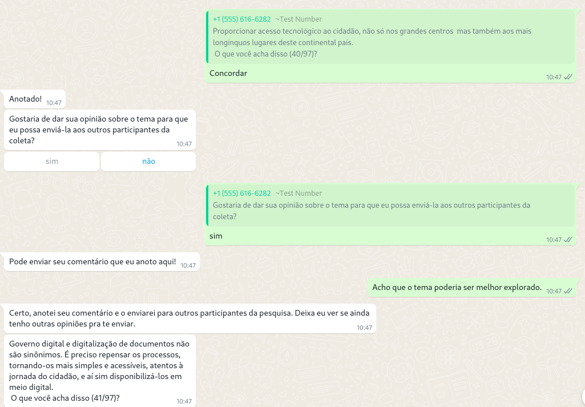
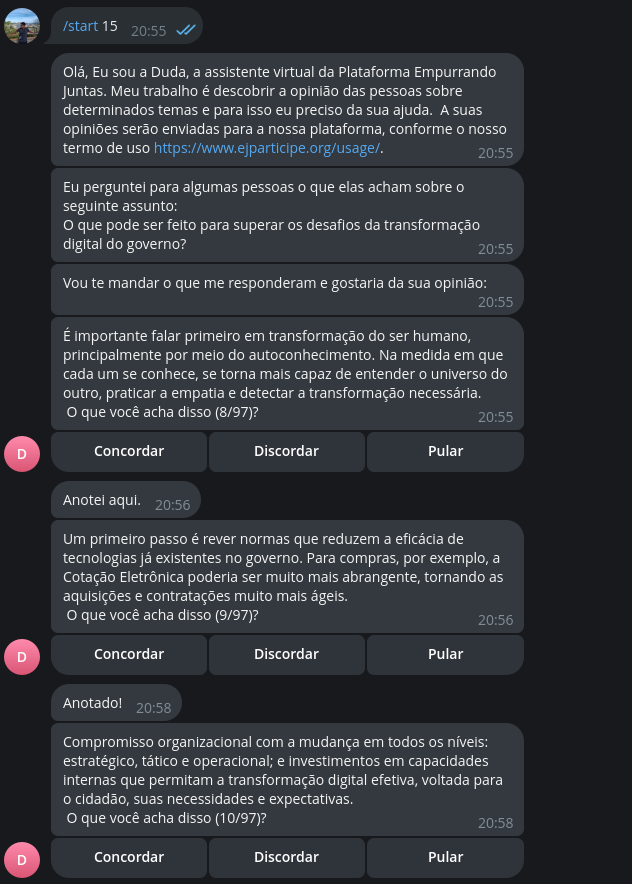
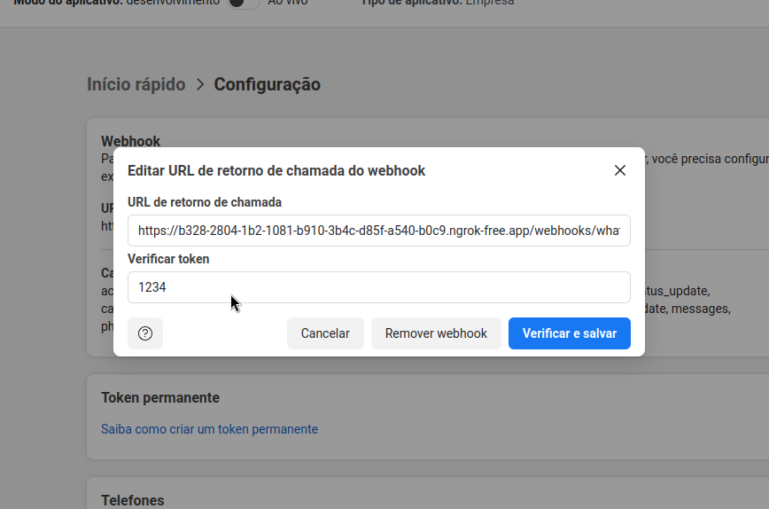

[[_TOC_]]


EjBot é o chatbot de pesquisa de opinião do projeto [Empurrando Juntas (EJ)](https://gitlab.com/pencillabs/ej/ej-application).
Com ele, é possível participar em conversas da EJ no Telegram e WhatsApp. O projeto utiliza o [Framework Rasa](https://rasa.com/) para construir os fluxos conversacionais que o chatbot terá com o usuário final. Ao participar de uma conversa em um dos canais, o usuário será capaz de:

- Receber uma mensagem de boas-vindas e visualizar o título da conversa.
- Votar nos comentários da conversa.
- Adicionar um novo comentário que será enviado para moderação.
- Se autenticar em um sistema externo, caso a funcionalidade de votação anônima tenha sido habilitada na conversa. 

| Canal          | Imagem |
| ---------------- | ----------------------------------------------------------------------------------------------------------------------------------------------------------------------------------------------------------------------------------------------------------------------------------------------------------------------------------------------------------------------------------------------------------------------------------------------------------------------------- |
| WhatsApp     |  |
| Telegram       | |

# Configuração do Rasa

A execução do bot depende dos pacotes docker e docker compose. Siga os passos a seguir para 
realizar a configuração do ambiente.
**O ambiente de desenvolvimento foi homologado em distribuições Linux Debian-like**.

**1. Crie o arquivo .env a partir do arquivo .env.sample**

O arquivo `.env.sample` possui todas as variáveis utilizadas pelo Chatbot.
Essas variáveis precisam ser alteradas dependendo do ambiente em que o Chatbot será executado.
No ambiente de desenvolvimento, por exemplo, você pode precisar que a variável `EJ_HOST` aponte para
uma instância da EJ disponibiliada localmente.

Crie um arquivo `.env` a partir do `.env.sample` e customize as variáveis de acordo com
as suas necessidades. Esse arquivo não será versionado pelo Git.

**2. Treine o modelo NLU.**

Execute o comando `make prepare`. Ele é responsável por gerar a imagem base para os 
containers do chatbot, actions e couch. 

- chatbot: interface conversacional responsável por responder mensagens a partir do modelo NLU.
- actions: módulos Python responsáveis por integrar a interface conversacional com a API da EJ.
- couch: componente do Rasa responsável por gerar o modelo NLU a partir da estrutura de histórias.

**3. Crie um conversa na EJ**

Altere a variável `EJ_HOST`, indicando o endereço e porta do ambiente EJ que será
utilizado durante a pesquisa. No ambiente local, esse endereço precisa ser o IP privado do
seu computador. 

Certifique-se que o seu ambiente EJ está aceitando requisições a partir do IP privado. 
Isso é feito adicionando o IP na variável de ambiente `DJANGO_ALLOWED_HOSTS`. Para mais 
informações, acesse o [o repositório](https://gitlab.com/pencillabs/ej/ej-application/-/blob/develop/docker/variables.env?ref_type=heads).

Para interagir com o bot no ambiente local é necessário criar uma conversa na 
plataforma e adicionar comentários a serem votados. Com a conversa criada, 
recupere o ID da URL da conversa e guarde essa informação.

**4. Execute a api do Rasa e o servidor de Actions.**

Com a EJ configurada, execute os seguintes comandos:

- `make run-store`. Esse comando irá subir os serviços do Redis e PostgreSQL, responsáveis por armazenar o contexto das conversas.
- `make run-api`. Esse comando irá subir a API do Rasa para termos os endpoints de webhook definidos
nos arquivos de `credentials`.
- `make run-actions`. Esse comando irá subir os módulos Python responsáveis por requisitar
nos endpoints da EJ.

Todos os comandos precisam ser executados em parelelo para o correto funcionamento do chatbot.
Verifique se o Rasa está rodando acessando `http://localhost:5006`.

# Testando o chatbot via shell

Após configurar a API e o servidor de Actions, é possível interagir com o chatbot por meio
do shell do Rasa. O primeiro passo é entrar no container do Rasa com o comando `make attach`. 
Depois, basta executar o comando `make shell`, que o Rasa irá abrir uma chat dentro do terminal
para que você possa interagir com o chatbot.

# Integração no Telegram

**1. Crie um bot com o BotFather**

Para que a EJ possa receber os eventos do Telegram, é preciso primeiro criar um novo
bot com o @BotFather. Siga [essa documentação](https://core.telegram.org/bots/tutorial) 
para realizar a criação.

No ambiente local, a URL https pode ser gerada com o projeto [Ngrok](https://ngrok.com/).
Você precisará apontar para a porta `5006`, que é a porta utilizada pela API do Rasa.

```shell
$ ./ngrok http 5006
```


Após criar o bot, altere no arquivo `variables.env` o token, o nome do bot e a 
URL https que o Telegram irá utilizar para enviar os eventos.

```
TELEGRAM_TOKEN=<token que o BotFather vai gerar>
TELEGRAM_BOT_NAME=<nome do bot que você criou>
TELEGRAM_WEBHOOK_URL=<url https do ngrok>/webhooks/telegram/webhook
```
Após alterar as variáveis, reinicie o módulo actions e a API do Rasa.

**2. Teste a conexão com o Telegram**

Supondo que o ID da sua conversa seja 50, execute os próximos passos:

- Acesse o seu bot no Telegram
- Envie para ele a mensagem `/start 50`.

O Telegram enviará para a URL HTTPS a mensagem "/start 50".
A API do Rasa extrairá o ID da mensagem e o componente Actions irá requisitar
na API da EJ a conversa de ID 50. A partir dai, o fluxo de participação é iniciado.

# Integração no WhatsApp

A integração com o WhatsApp utiliza um conector customizado, disponível no módulo
`bot/addons/custom_channel.py`. Esse módulo disponibiliza a rota `/webhooks/whatsapp/webhook`
para que o WhatsApp e parceiros possam enviar os eventos que forem gerados durante a
interação com o chatbot. Atualmente, a integração suporta eventos enviados tanto pelo
WhatsApp Cloud API quanto pela API do Serpro.

## WhatsApp Cloud API

**1. Solicite um número de testes**

A integração com o WhatsApp utiliza a [Cloud API do Meta](https://developers.facebook.com/docs/whatsapp/cloud-api/get-started#configure-webhooks).
É preciso seguir as instruções da documentação para criar uma conta de desenvolvedor e
um aplicativo do tipo Empresa. Com isso feito, basta configurar o webhook no painel
de desenvolvedor utilizando a URL do Ngrok, para receber os eventos de mensagem.

**2. Atualize as variáveis de ambiente**

O Rasa permite ao desenvolvedor implementar endpoints customizados para receber eventos
de canais que não são suportados oficialmente. No arquivo `bot/addons/custom_channel.py` 
está a o endpoint responsável por receber os eventos do Cloud API.

O processo de extrair as mensagens dos eventos do WhatsApp é feito utilizando os
módulos do repositório [whatsapp_api_integration](https://gitlab.com/pencillabs/ej/whatsapp-api-integration).
É preciso clonar esse repositório dentro do diretório `bot/addons`.
O endpoint utiliza esses módulos para enviar o texto digitado pelo usuário para o
componente do Rasa responsável pelo processamento de linguagem natural.

Com a conta de desenvolvedor configurada, atualize o arquivo `variables.env` 
com os valores disponibilizados no painel do Facebook.
 
```
WPP_AUTHORIZATION_TOKEN=<token de authorização do WhatsApp para API de mensagens>
WPP_VERIFY_TOKEN=<token de verificação aleatório>
WPP_PHONE_NUMBER_IDENTIFIER=<identificador do número de telefone de testes>
```

Após alterar as variáveis, reinicie o módulo actions e a API do Rasa.

**3. Configure o webhook**

No ambiente local, a URL https pode ser gerada com o projeto [Ngrok](https://ngrok.com/).
Você precisará apontar para a porta `5006`, que é a porta utilizada pela API do Rasa.

```shell
$ ./ngrok http 5006
```

No painel de desenvolvedor, inclua a URL https do Ngrok com a subrota `/webhooks/whatsapp/webhook`
para o endpoint do WhatsApp. Não esqueça de habilitar os eventos de webhook no painel de desenvolvedor,
caso contrário, mesmo enviando mensagens na conversa, a API do rasa não receberá nenhuma requisição.



**4. Teste a conexão**

Com o número de teste e o número do destinatário, teste a comunicação do WhatsApp com o
Rasa em uma conversa entre ambos os números. Envie `/start ID-DA-CONVERSA-NA-EJ` na
conversa e verifique se a requisição irá chegar no Rasa por meio da URL do Ngrok.

## Serpro

A implementação desse repositório também suporta receber eventos da [API do Serpro para
integração com WhatsApp](https://gitlab.com/pencillabs/ej/ej-application/-/merge_requests/307).
Essa integração é especialmente util para cenários de uso governamental, em que é necessário
utilizar um parceiro credenciado pela Meta para acesso às API de mensagem.

**1. Solicite as credenciais**

Para utilizar esse modo de integração, é preciso que a equipe do Serpro envie as seguintes
credenciais:

- Client ID
- Secret
- Phone Number Id
- Waba ID

Com as credenciais, atualize o arquivo `variables.env`:
```
SERPRO_CLIENT_ID=138808512639290
SERPRO_CLIENT_SECRET=kLaVl2fSevwX4EdESxXC8J1W462XVXLP
SERPRO_WABA_ID=110115228401530
```

**2. Configure o Rasa para receber os eventos.**

A API do Serpro irá enviar os eventos do WhatsApp para a instância do Rasa na rota
`/webhooks/whatsapp/webhook`. Para desenvolvimento local, é possível criar um servidor
na nuvem e realizar uma configuração de [tunelamento para o servidor](https://gist.github.com/gdamjan/4586758). 
Em produção/homologação, o Rasa precisará estar rodando na máquina virtual que 
responderá ao domínio de webhook.


**3. Registre o webhook pela API do Serpro.**

Com as credenciais e a infraestrutura para recebimento dos eventos disponível, é preciso
cadastrar o webhook na API do Serpro. O método `register_webhook` do módulo
`bot/addons/whatsapp_api_integration/serpro_api_client.py`, pode ser utilizado para
a criação do webhook a partir das credenciais enviadas pelo Serpro.

| Variável                     | Valor padrão                                 | Descrição                                                                                                                         |
| ---------------------------- | -------------------------------------------- | --------------------------------------------------------------------------------------------------------------------------------- |
| JWT_SECRET                   | ""                                           | Sequência de caracteres randômica que será utilizada para gerar o token de autenticação com o sistema externo ao canal.           |
| SECRET_KEY                   | qGaUJ_XjpOfomnPNpOawtft2dVN0Rsu6wKLLtNIaeKM= | Sequência de caracteres randômica que será utilizada para gerar a senha do usuário.                                               |
| RASA_MAX_CACHE_SIZE          | 0                                            | Se for 0, desabilita o uso de cache do Rasa durante o treinamento do modelo                                                       |
| RASA_DOMAIN                  | default                                      | Nome do arquivo de domínio que será utilizado para treinar o chatbot.                                                             |
| BOARD_ID                     | 1                                            | Identificador do board da EJ que será utilizado para apresentar as conversas ao participante.                                     |
| TELEGRAM_TOKEN               |                                              | Token gerado pelo `BotFather` após a criação do bot no Telegram                                                                   |
| TELEGRAM_BOT_NAME            |                                              | Nome do bot criado com o `BotFather`                                                                                              |
| TELEGRAM_WEBHOOK_URL         |                                              | URL https do Rasa, que irá receber os webhooks do Telegram.                                                                       |
| WPP_AUTHORIZATION_TOKEN      |                                              | Token de autorização gerado no painel da Meta, para acesso à API do WhatsApp.                                                     |
| WPP_VERIFY_TOKEN             |                                              | Token de verificação cadastrado no painel da Meta.                                                                                |
| WPP_PHONE_NUMBER_IDENTIFIER  |                                              | Identificador do número de telefone no painel da Meta.                                                                            |
| ACTIONS_SERVER_URL           | http://actions:5055/webhook                  | URL do servidor de actions do Rasa.                                                                                               |
| RASA_DUCKLING_HTTP_URL       | http://duck:8000                             | URL do servidor Duckling, responsável por identificar padrões nas menssagens dos usuários.                                        |
| EJ_HOST                      | http://192.168.15.133:8000                   | Endereço do HOST da EJ que será utilizado pelo chatbot para requisitar a conversa e outras informações.                           |
| ENV                          | local                                        | Variável utilizada para decidir qual arquivo `credencials` carregar quando a API do Rasa for iniciada.                            |
| REDIS_HOST                   | redis                                        | HOST da instância do Redis utilizada como LockStore do Rasa                                                                       |
| REDIS_PORT                   | 6379                                         | Porta da instância do Redis utilizada como LockStore do Rasa                                                                      |
| DB_HOST                      | postgres                                     | HOST da instância do PostgreSQL utilizado como TrackerStore do Rasa                                                               |
| DB_DATABASE                  | rasa                                         | Nome do banco que será criado para armazenar os Trackers do Rasa                                                                  |
| DB_USER                      | rasa                                         | Usuário que o Rasa irá utilizar para se conectar no TrackerStore                                                                  |
| DB_PASSWORD                  | rasa                                         | Senha que o Rasa irá utilizar para se conectar no TrackerStore                                                                    |
| DB_PORT                      | 5432                                         | Porta da instância do PostgreSQL que atua como TrackerStore                                                                       |
| EXTERNAL_AUTHENTICATION_HOST | https://lab-decide.dataprev.gov.br           | URL do serviço externo que será utilizado para autenticar o usuário que participa no Telegram ou no WhatsApp.                     |
| BP_EJ_COMPONENT_ID           | processes/planocultura/f/184                 | Caminho para o componente de opinião da EJ configurado no Decidim. Será utilizada em conjunto com o EXTERNAL_AUTHENTICATION_HOST. |


# Comandos

São utilizados comandos make para execução de diferentes contextos e ferramentas do bot, os principais são descritos a seguir:

| Comando          | Descrição |
| ---------------- | ----------------------------------------------------------------------------------------------------------------------------------------------------------------------------------------------------------------------------------------------------------------------------------------------------------------------------------------------------------------------------------------------------------------------------------------------------------------------------- |
| make prepare     | Realiza o build do ambiente e o treinamento do modelo NLU. |
| make train       | Realiza apenas o treinamento dos modelos. É necessário rodar esse comando sempre que há alterações nos arquivos de domain, nlu, stories, rules ou config.yml.|
| make run-shell   | Abre o bot no terminal para realizar interações no terminal |
| make run-api     | Executa o bot no modo API. No ambiente local, ela ficará disponível na url `http://localhost:5006` |
| make run-actions | Executa os módulos de backend (Actions). Esses módulos implementam a comunicação dot chatbot com a API da EJ e outros serviços externos ao bot. |
| make clean       | Remove os containers e limpa o ambiente. |

# Testes

O rasa possui uma [documentação básica de testes](https://rasa.com/docs/rasa/testing-your-assistant/), recomenda-se sua leitura antes da execução dos comandos.

Além dos testes, o Gitlab CI executa a folha de estilo do projeto, implementada por meio da biblioteca **black**.

A execução de testes também é realizada por meio de comandos make, listados a seguir:

| Comando            | Descrição                                                                                                                                                                              |
| ------------------ | -------------------------------------------------------------------------------------------------------------------------------------------------------------------------------------- |
| make test          | Executa os testes listados no arquivo bot/tests/test_stories.yml. Esses testes são e2e, simulando a interação do usuário com o bot.                                                    |
| make test-actions  | Executa os testes listados na pasta bot/tests/ que sejam do tipo python (.py). Esses testes são unitários, testando os métodos que são utilizados nas actions do bot.                  |
