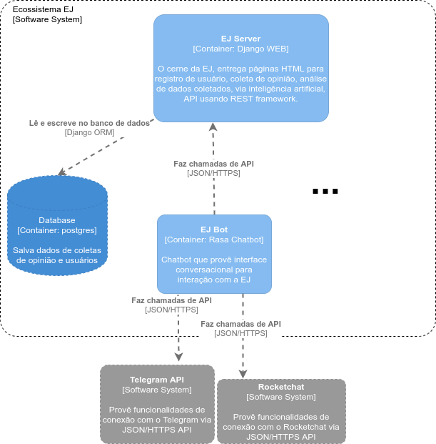
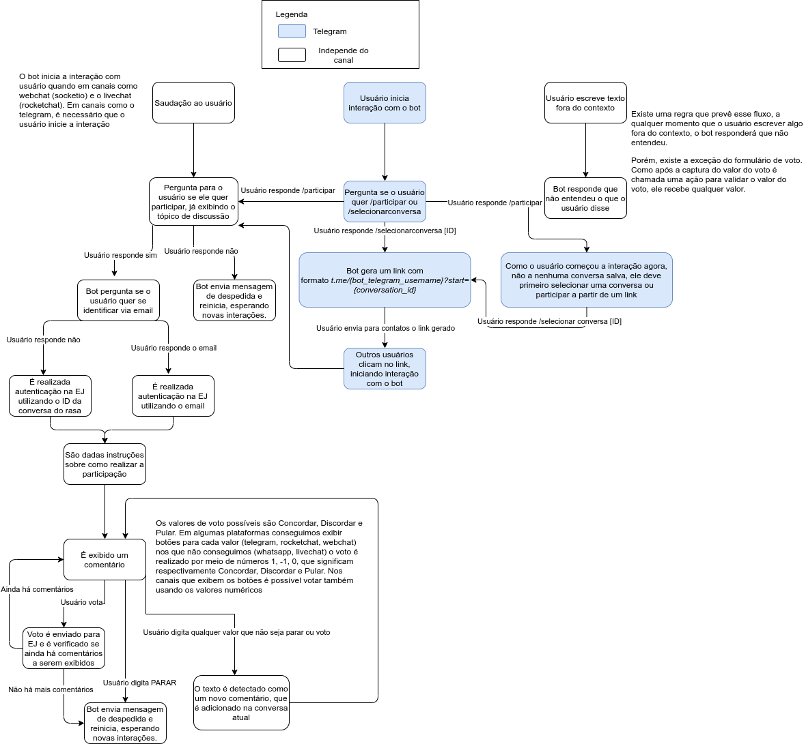
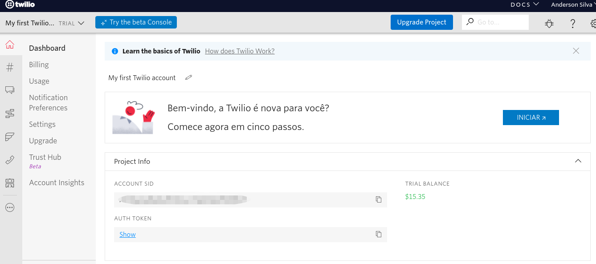
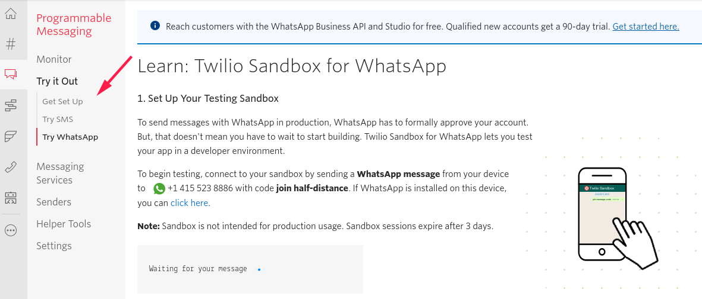
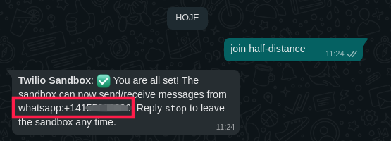
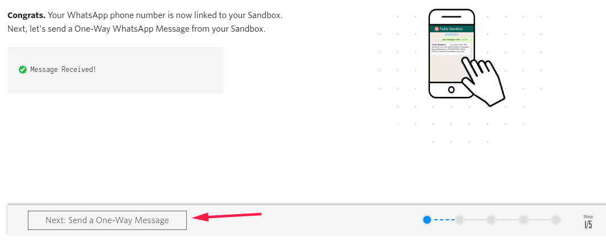
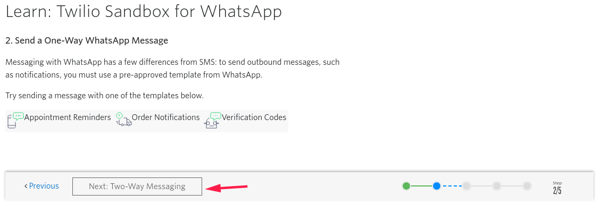
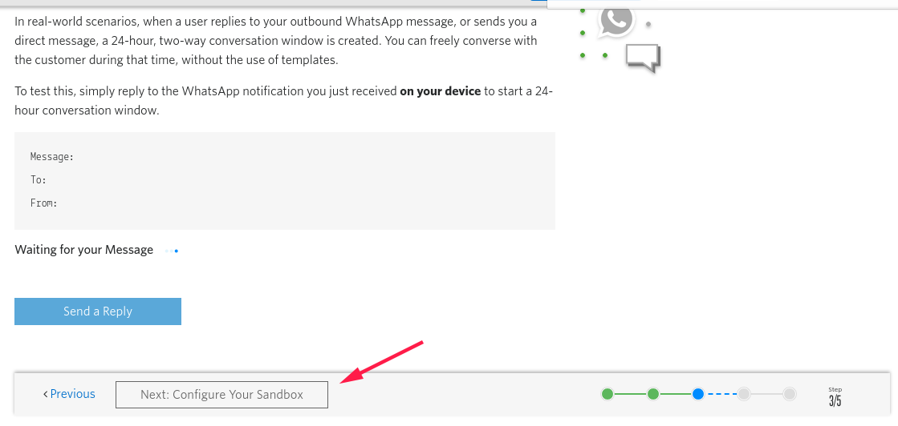
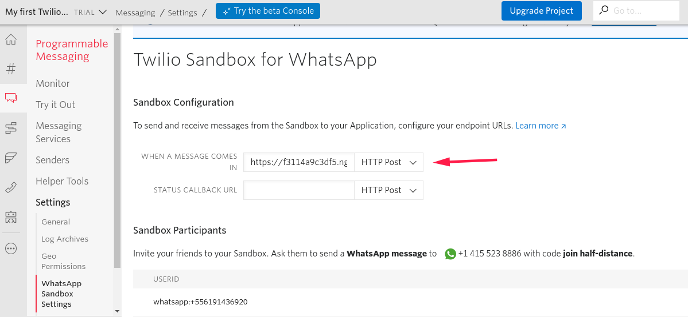

# EJ Bot

## Contexto

Este bot faz parte do ecossistema Empurrando Juntas, composto por alguns projetos que possuem forte relação entre si.
A imagem abaixo ilustra um recorte desse ecossistema, colocando em destaque o **EJ server** - o núcleo desse contexto - e o **EJ bot**, que está no presente repositório.



No **EJ server** usuários podem criar conversas para iniciar discussões, a partir dessas são realizados comentários, que então são exibidos para outros usuários votarem se concordam ou não - podendo também pular caso não saibam opinar. Todas essas interações são realizadas por meio de um website. Porém, o **EJ server** também possui uma REST API, servida por meio do protocolo HTTP, que permite seu uso além do ambiente web.

Dessa forma, o **EJ bot** permite a interação com conversas criadas no servidor web, por meio de uma interface conversacional, isto é, utilizando um chatbot para interação com o usuário. Para isso, o bot comunica-se com o servidor web realizando requisições HTTP.

# Primeiros passos

Para começar a conversar com a Duda é necessário primeiramente a instalação do docker e docker-compose. **O ambiente de desenvolvimento do bot foi homologado em distribuições linux Debian-like**. Instaladas as dependências necessárias, siga os seguintes passos:

1. Abra dois terminais;
2. No primeiro execute o comando `make prepare`, espere o comando finalizar. Ele é responsável por gerar a imagem base para os containers do bot, actions e couch. O `make prepare` usa como padrão o domínio domain.default.yml. Para especificar outro domínio como, por exemplo, o do boca de lobo, basta especificar o dominio da seguinte forma: `make prepare domain=bocadelobo`;
3. Após a finalização do comando anterior, suba a api (no primeiro terminal): `make run-api`;
4. Agora, suba o servidor de actions (no segundo terminal): `make run-actions`;

Verifique se o Rasa está rodando acessando `http://localhost:5006`.

Para interagir com o bot no ambiente local é necessário primeiro criar uma conversa na plataforma e adicionar comentários a serem votados.
Com a conversa criada, acesse a área de ferramentas da conversa em `Ferramentas->Bot de Opinião -> Webchat` e clique em **Iniciar coleta**.
A EJ irá conectar na instância local do Rasa e iniciar a pesquisa de opinião.

É necessário rodar o comando `make clean` sempre que for trocar de domain para evitar que o bot se perca no fluxo.

# Fluxo de trabalho

São utilizados comandos make para execução de diferentes contextos e ferramentas do bot, os principais são descritos a seguir:

| Comando          | Descrição                                                                                                                                                                                                                                                                                                                                                                                                                                                                     |
| ---------------- | ----------------------------------------------------------------------------------------------------------------------------------------------------------------------------------------------------------------------------------------------------------------------------------------------------------------------------------------------------------------------------------------------------------------------------------------------------------------------------- |
| make prepare     | Realiza o build do ambiente e o treinamento do primeiro modelo. Sem especificar o domínio, é utilizado o domínio padrão (domain.default.yml). Para especificar outro domínio, por exemplo o boca de lobo, é necessário especificá-lo da seguinte forma: `make prepare domain=bocadelobo`. No momento, existem dois domínios diferentes, o `default` e o `bocadelobo`.                                                                                                         |
| make train       | Realiza o treinamento dos modelos. É necessário rodar esse comando sempre que há alterações nos arquivos de domain, nlu, stories, rules ou config.yml. Sem especificar o domínio, é utilizado para o treinamento o domínio padrão (domain.default.yml). Para especificar outro domínio, por exemplo o boca de lobo, é necessário especificá-lo da seguinte forma: `make train domain=bocadelobo`. No momento, existem dois domínios diferentes, o `default` e o `bocadelobo`. |
| make run-shell   | Abre o bot no terminal para realizar interações no terminal                                                                                                                                                                                                                                                                                                                                                                                                                   |
| make run-api     | Executa o bot no modo api, é utilizado para poder rodar instâncias como webchat, telegram e rocketchat. A api fica disponível em localhost:5006                                                                                                                                                                                                                                                                                                                               |
| make run-actions | Executa a api de custom actions. É essa api que implementa toda a comunicação com a EJ e outros serviços externos ao bot.                                                                                                                                                                                                                                                                                                                                                     |
| make clean       | Remove os containers e limpa o ambiente.                                                                                                                                                                                                                                                                                                                                                                                                                                      |

Para outros detalhes, a listagem e documentação dos comandos make disponíveis pode ser vista com o comando:

```
make help
```

Como mostrado no diagrama do ecossistema EJ, para que o bot funcione ele depende de uma instância da EJ server rodando. Por padrão, a variável de ambiente `EJ_HOST` vem com valor do ambiente de homologação da pencillabs, `https://ejplatform.pencillabs.com.br`. Porém, caso necessário,
o desenvolvedor pode apontar o bot local para uma instância local da EJ, por meio do IP privado. Para isso ele pode digitar o comando `hostname -I` ou `ip addr | grep wl`, e realizar a substituição pelo IP de sua máquina por meio das instruções que estão no arquivo `env/servers.env`, onde também deve substituir o valor da variável.

# Rasa Boilerplate

A estrutura desse projeto foi baseada na [documentação do rasa](https://rasa.com/docs/rasa/) e [também no boilerplate](https://github.com/lappis-unb/rasa-ptbr-boilerplate).

# Estrutura básica do projeto

Abaixo, segue em destaque na estrutura de pastas os arquivos que serão mais utilizados durante o desenvolvimento, para que haja evolução da interface conversacional do bot. Nota-se que é importante seguir o padrão de nomeclatura do rasa, para que ele consiga interpretar corretamente os diferentes contextos (por exemplo utter_nome).

```shell
-- bot/
    -- actions/
        - actions.py # onde são importadas as classes de Action.
        - comment_actions.py # Actions responsáveis pelo envio de comentários para a EJ.
        - vote_actions.py # Actions responsáveis pelo envio de votos para a EJ;
        - setup_actions.py # Actions responsáveis por requisitar os dados da conversa na EJ;
        - conversation_actions.py # Actions responsáveis por controlar o fluxo da conversa do usuário;
    -- data/
        - nlu.yml # aqui são definidas as intents, que são as entradas esperadas do usuário
        - rules.yml #
        - stories.yml # cada story é um fluxo que deve ocorrer entre o usuário e o bot
    -- domain.yml # são definidas as utter, respostas do bot que são apenas texto e também  descreve o domínio do bot, que inclue intents, entities, slots, templates e actions que o bot deve ter consciência.
    -- endpoints.yml # arquivo que contém a configuração do webhook para uma ação personalizada
    -- tests/
        - test_stories.yml # testes dos fluxos de conversas
        - test_actions.py # teste das ações e outros recursos, usando pytest
```

## Como o bot funciona?

Atualmente, os fluxos de uso do bot implementados, estão representados no diagrama a seguir:



# Containers

A aplicação é dividida em diferentes containers do docker, que são listados e explicados sucintamente a seguir.

## Coach

Realiza o treinamento das modelos

## Rasa

Permite a execução do rasa no modo de api, shell.

## Duckling

Execute o servidor duckling que extrai entidades como e-mail, valores numéricos e urls

# Testes

O rasa possui uma [documentação básica de testes](https://rasa.com/docs/rasa/testing-your-assistant/), recomenda-se sua leitura antes da execução dos comandos.

Além dos testes, o Gitlab CI executa a folha de estilo do projeto, implementada por meio da biblioteca **black**.

A execução de testes também é realizada por meio de comandos make, listados a seguir:

| Comando            | Descrição                                                                                                                                                                              |
| ------------------ | -------------------------------------------------------------------------------------------------------------------------------------------------------------------------------------- |
| make test          | Executa os testes listados no arquivo bot/tests/test_stories.yml. Esses testes são e2e, simulando a interação do usuário com o bot.                                                    |
| make test-actions  | Executa os testes listados na pasta bot/tests/ que sejam do tipo python (.py). Esses testes são unitários, testando os métodos que são utilizados nas actions do bot.                  |
| make run-test-nlu  | Executa o teste do NLU por meio da validação cruzada, que cria automaticamente várias divisões de treinamento/teste a partir das intents que foram criadas no arquivo bot/data/nlu.yml |
| make run-test-core | Executa uma avaliação da modelo de diálogo treinada em um conjunto de histórias de teste, criado automaticamente pelo rasa analisando as histórias em bot/data/stories.yml             |

Os testes são executados pela Integração Contínua, e ela está utilizando a flag --fail-on-prediction-errors , que significa que caso predições dos testes realizados pelo rasa não estejam corretas, quebrará a Integração Contínua. Há a possível evolução para utilização da flag
--fail-on-warnings, que quebrará mesmo com problemas menores.

# Canais do bot

## WebChat

Você pode simular uma conversa com o ejBot a partir de um webchat. Esse canal é integrado diretamente
na EJ, através da área de ferramentas de uma conversa.


## Telegram

Para configurar o bot do telegram, é necessário sua criação com o [Fatherbot](https://core.telegram.org/bots#3-how-do-i-create-a-bot). A partir disso, obterá um token e um username. Além desses valores, deve-se ter o link do webhook, que em ambiente local deve ser gerado pelo ngrok, como é explicado no próximo subtópico. O bot no telegram vem por padrão desativado, então você deve descomentar as linhas do arquivo `bot/credentials.local.yml`, referentes à conexão com o Telegram.
Além disso, também é necessário atualizar as respectivas variáveis de ambiente (nomeadas a seguir), no arquivo `env/auth.env`:

```
TELEGRAM_TOKEN=<token que o fatherbot vai gerar>
TELEGRAM_BOT_NAME=<nome do bot de teste que você criou>
TELEGRAM_WEBHOOK_URL=<url https do ngrok, que iremos gerar no próximo subtopico>
```

Além de colocar os valores das váriveis, a seguinte seção do arquivo `bot/credentials.local.yml`
deve ser descomentada:

```
custom_channels.TelegramInputChannel:
  access_token: ${TOKEN_PROVIDED_BY_FATHER_BOT}
  verify: ${BOT_USERNAME}
  webhook_url: "${TELEGRAM_WEBHOOK_URL}"
```

## Whatsapp

Para conectar no whatsapp é necessário criar uma conta no
[twilio](https://www.twilio.com/) e receber os valores das variáveis de ambiente.

Após o cadastro, na home page podem ser acessadas duas das três variaveis necessárias.



Agora vá no menu de Programmable SMS -> Try it Out -> Try Whatsapp



E mande a mensagem de confirmação para o número do twilio que aparecer na tela com a mensagem solicitada. Para receber a terceira variável necessária.



**Atenção**: Deve ser usado toda a área marcada e não somente o numero, Ex.: whatsapp:+14155999999

Nas próximas telas não é necessário informar mais opções, apenas avance.





Avançe até chegar a tela abaixo e informe o seu endereço **https** no ngrok + /webhooks/twilio/webhook. Ex.: https://f3114a9c3df5.ngrok.io/webhooks/twilio/webhook



É necessário atualizar as respectivas variáveis de ambiente (nomeadas a seguir), no arquivo `env/auth.env`:

```
TWILIO_SID=<Acessado na home do dashboard do projeto>
TWILIO_AUTH_TOKEN=<Acessado na home do dashboard do projeto>
TWILIO_WHATSAPP=<Acessado no menu Programmable SMS/Try it Out/Try Whatsapp >

```

Além de colocar os valores das váriveis, a seguinte seção do arquivo `bot/credentials.local.yml`
deve ser descomentada:

```
twilio:
  account_sid: ${TWILIO_SID}
  auth_token: ${TWILIO_AUTH_TOKEN}
  twilio_number: ${TWILIO_WHATSAPP}
```

## Configuração do ngrok

Neste repositório, foi criado um bot para ambiente de desenvolvimento local, chamado duda_local_bot. Porém, o telegram aceita webhooks apenas que possuem o protocolo HTTPS.
Então para testá-la você pode fazer o download e instalação do aplicativo [ngrok](https://ngrok.com/download). Então, vá para o diretório que possui o programa e execute o comando :

```shell
$ ./ngrok http 5006
```

Com isso, será criado um túnel e serão exibidas as seguintes informações no terminal, copie o
endereço https que direciona para o localhost:5006 e o substitua na variável `TELEGRAM_WEBHOOK_URL`,
não esquecendo de acrescentar o /webhooks/telegram/webhook ao final da URL (no exemplo ficaria:
**https://10483b5f4.ngrok.io/webhooks/telegram/webhook**):

```shell
ngrok by @inconshreveable                                                                                                             (Ctrl+C to quit)

Session Status                online
Session Expires               1 hour, 59 minutes
Update                        update available (version 2.3.39, Ctrl-U to update)
Version                       2.3.38
Region                        United States (us)
Web Interface                 http://127.0.0.1:4040
Forwarding                    http://10483b5f4.ngrok.io -> http://localhost:5002
Forwarding                    https://10483b5f4.ngrok.io -> http://localhost:5002

Connections                   ttl     opn     rt1     rt5     p50     p90
                              0       0       0.00    0.00    0.00    0.00

```

Informações mais detalhadas das requisições realizadas para o endereço podem ser verificadas em
http://127.0.0.1:4040.

## Integração com a EJ

O bot, no ambiente local, utiliza o arquivo `env/servers.env` para se conectar nos serviços necessários para seu pleno funcionamento. Um desses serviços é a API da EJ. Por padrão o bot irá se conectar na EJ de homologação, mas você pode apontar o bot para uma instância local da EJ. Basta alterar a variável `EJ_HOST`, para o ip:porta do servidor django. Por exemplo, `EJ_HOST=192.168.15.100:8000`.

Ao final da configuração, seu arquivo `env/auth.env` deve ficar parecido com isso:

```
JWT_SECRET=thisismysecret
# Variables used in credentials.yml
TELEGRAM_TOKEN=1787218495:AAG2Kk7Q3S6vwA6neptdO0uyon-OdhXXZIM
TELEGRAM_BOT_NAME=DudaDavidBot
TELEGRAM_WEBHOOK_URL=https://895f9f8dad71.ngrok.io/webhooks/telegram/webhook
ROCKET_USER=
ROCKET_PASSWORD=
ROCKET_URL=
```

Para testar se seu bot do Telegram irá se conectar na EJ, basta subir a api do rasa via `make run-api`.

## Ambientes da duda

Existem 3 bots diferentes da duda, cada um de um ambiente diferente. São eles:

- duda_local_bot: ambiente de desenvolvimento local, que deve apontar para a instância local do desenvolvedor, criada via ngrok;
- DudaEjDevBot: ambiente de homologação, que aponta para a instância https://rasadefaultdev.pencillabs.com.br/;
- DudaEjBot: ambiente de produção, que aponta para a instância https://rasadefault.pencillabs.com.br/.


# Ambiente de Homologação

Toda vez que é realizado o deploy da aplicaçao, é realizado um novo treinamento do bot e então gerado um novo arquivo de model (salvo em `bot/models/*.tar.gz`). Dessa forma, existiu um problema quanto à ocupação de memória na máquina de homologação, que contornamos por meio de uma tarefa cron. Essa tarefa executa o script que encontra-se em `docker/clean_old_models.py`, que exclui as models que tenham mais de 1 semana de idade, caso haja mais de uma model na pasta. Para realizar a configuração para que a tarefa cron rode diariamente, basta rodar o comando:

`$ make run-cron`
